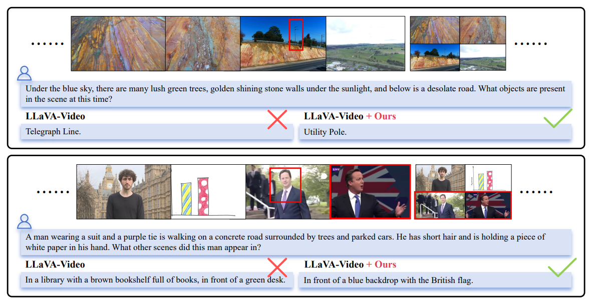

# Enhancing Visual Token Representations for Video Large Language Models via Training-free Spatial-Temporal Pooling and Gridding


We presented ST-GridPool, a training-free visual token enhancement method tailored for Video LLMs, which optimizes spatiotemporal token compression through Pyramid Temporal Gridding (PTG) and Norm-based Spatial Pooling (NSP). By capturing multi-grained temporal dynamics and preserving high-information spatial regions, our method significantly enhances video understanding performance across multiple datasets and models, including LLaVA-Video, without requiring retraining. ST-GridPool offers a scalable and efficient solution for improving visual token representations, demonstrating its potential as a plug-and-play enhancement for existing Video LLMs. 


We conduct experiments on various datasets, demonstrating effectiveness of our method.


Some examples collected from the experiment result of LongVideoBench.  




## Environment Setup

Please refer to https://github.com/EvolvingLMMs-Lab/lmms-eval

```bash
conda create --name exp1 python=3.10
pip install -e .
```

## Evaluation

We provide example scripts for reproducing results of our method. Raw logs of experimental results are put in 'logs/' directory.

For most datasets, you can get the final scores by replacing `$TASK` with dataset name and running the following command:

```bash
TASK=longvideobench_val_v
python -m accelerate.commands.launch \
    --num_processes=6 \
    -m lmms_eval \
    --model llava_video \
    --model_args pretrained=../model/llava-video,conv_template=qwen_1_5,model_name=llava_qwen,max_frames_num=64\
    --tasks $TASK \
    --batch_size 1 \
    --log_samples \
    --log_samples_suffix llava_video_$TASK \
    --output_path ./logs/
```

For EgoSchema, you need to additionally submit the inference results to the validation server for final scores:
```bash
TASK=egoschema
python -m accelerate.commands.launch \
    --num_processes=6 \
    -m lmms_eval \
    --model llava_video \
    --model_args pretrained=../model/llava-video,conv_template=qwen_1_5,model_name=llava_qwen,max_frames_num=64\
    --tasks $TASK \
    --batch_size 1 \
    --log_samples \
    --log_samples_suffix llava_video_$TASK \
    --output_path ./logs/

# submit to the validation server
python submit_egoschema.py --f logs/submissions/inference_results_egoschema_MC_xxx.json
```

## Acknowledgement
We sincerely thank the following repositories:
- [lmms-eval](https://github.com/EvolvingLMMs-Lab/lmms-eval)
- [LLaVA-Next](https://github.com/LLaVA-VL/LLaVA-NeXT)
- [EgoSchema](https://github.com/egoschema/egoschema)
